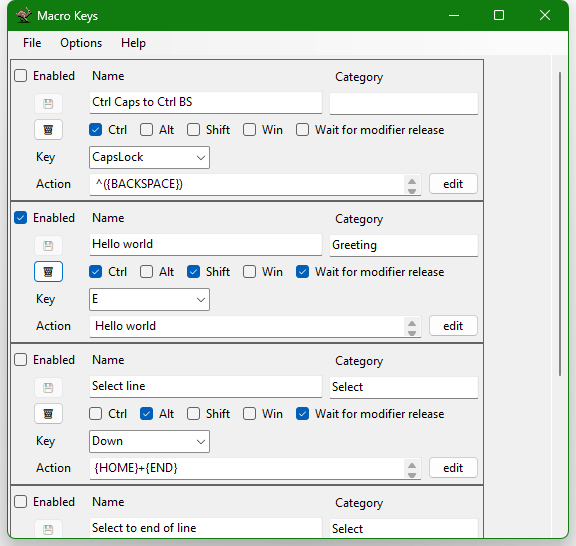
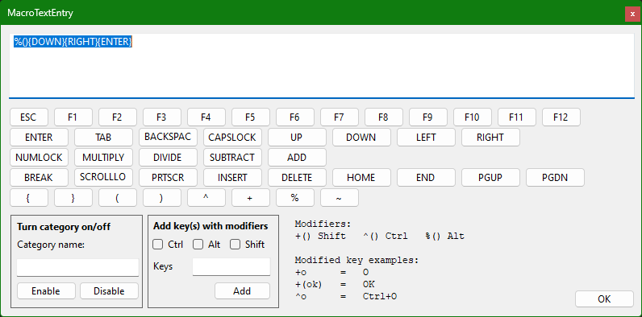

# MacroKeys

This application lets you set up macros, strings of keypresses to perform a task or output a text. Macros are triggered by using a keyboard hotkey.

Each macro is defined in a simple text file.

There are some limitations on how to write the macro you need to be aware of, like special characters that will alter or break the macro or other peculiarities.

Read the sections below for more details, especially if you have encountered an error while using a hotkey or macro.

### No game support

These macros are sent using the SendKey functions in Windows, and will only work in normal Windows applications. Most games will not recognize these keypresses, since they read the keyboard in a different way.

## Hotkeys

Hotkeys are either single key presses, or a combination of a single key and modifier keys.

Modifiers are Ctrl, Alt, Shift and Win.

Single keys in this context is any keyboard button except the modifiers.

### Key names

Each keyboard key has a special name, which can be found using the drop down list in the Key field. You can enter these by hand instead of using the drop down, but be aware that they are case sensitive.

There are more obscure keys than what are listed in the drop down menu. For a full list, [see Microsoft documentation](https://learn.microsoft.com/en-us/dotnet/api/system.windows.forms.keys?view=windowsdesktop-7.0)

### Modifiers

Modifiers are Ctrl, Alt, Shift and Win.

The option "Wait for modifier release" will wait to execute the macro until you have let go of any modifiers pressed while inputting the hotkey.

It's recommended to keep this setting ON, in order to avoid combinations such as Ctrl+S from triggering if you hold Control and there's an S in the macro.

### Errors

If you enter an unrecognized key, or the key can't be registered because it's already in use, the Key field will turn yellow to indicate an error.

Some hotkeys are reserved by other applications or Windows itself. Some of the ones involving the Win key don't work even if they can be configured.

## Macro output

Use the Action text box to define your macro output.

Macros are sent one keystroke at a time using the SendKeys method. This simulates keypresses, including using the modifier keys to create whatever character you've entered into the text.

### Warning about long texts

Once a macro output has started, it can't be stopped, so sending long pieces of text should be avoided if it's likely other applications take focus.

If you need to output long pieces of text, it's better to use something like Sticky Notes, or ClipboardTool.

### Errors

If there's an error during the macro output, the Action text box will turn orange. This is usually because there's a special character like ( ) parentheses or \{ \} curly braces in the text that isn't part of a special key, and hasn't been enclosed in \{ \} curly braces.

See the next section to correctly insert special characters.

### Special characters

Some characters have special meaning in the macros, and will cause modifiers to be pressed. If you want to output these characters as text, they must be enclosed in \{ \} curly braces.

The following characters MUST be enclosed, or the macro will misbehave or crash:
\{ \} \( \) ^ + % ~

Use the Edit button next to the Action text to insert these characters or special keys.

### Modifiers

To output keys with modifiers, use a special character before the key. If you want to press more than one character while holding the modifier, enclose the keys in ( ) parentheses.
- Ctrl: ^
- Alt: %
- Shift: +

Example: +hello world
Output: Hello world

Example +(hello) world
Output: HELLO world

Example: hell^o world
Output: hell[Ctrl+O] world

### Sending Keyboard keys

You can send special keys, by enclosing the name of the key in \{ \} curly braces. The available keys are found by pressing the Edit button next to the Action text box.
Examples: \{ENTER\}, \{F1\}, \{DOWN\}

More info in the [Microsoft documentation](https://learn.microsoft.com/en-us/dotnet/api/system.windows.forms.sendkeys.send?view=windowsdesktop-8.0)

## Categories

Each macro can have an optional Category tag. You can use this as a reminder of what the key is for, or for enabling or disabling keys in that category

### Enable or disable a macro category

You can use a special code in a macro Action to turn on or off all macros in a category. Use the special code \{\[enable:Example\]\} or \{\[disable:Example\]\}.

You can add this code more easily if you click the Edit button next to Action text box to insert a new Enable or Disable code. Use buttons in the "Turn category on/off" panel.

		Example: You want to enable all macros you use in one application, and disable all the ones used in another
		{[disable:Coding]}{[enable:Excel]}

## Edit macro Action

Press Edit next to the Action text box to open the Text Entry window, where you can insert correctly formatted code into your Action text.

## Macro files

Each macro is stored in a .txt file in the Macros folder. You can create new macros by clicking File > New, or by adding new text files to this folder and restarting the application.

### File layout

The macro .txt files read each setting based on the line numbers. You can't alter the line numbers the values are on. Some lines are there for comments or white space.

Example Macro File

		Don't add or remove any lines below, the line numbers are used to read the file correctly:
		NAME:
		Example, Hello

		CATEGORY:
		Examples

		DESCRIPTION:
		Just an example

		ENABLED:             // Enabled True or False
		True

		KEY:                 // Hotkey Key, see https://learn.microsoft.com/en-us/dotnet/api/system.windows.forms.keys?view=windowsdesktop-7.0
		E

		MODIFIERS:           // Modifiers, choose 0-4 of Ctrl Alt Shift Win
		Ctrl Alt Shift Win

		WAIT FOR MODIFIER RELEASE: 
		True

		ACTION:              // The sequence of keys to fire, for special keys, see https://learn.microsoft.com/en-us/dotnet/api/system.windows.forms.sendkeys?view=windowsdesktop-8.0
		Hello world!

The final lines of the file is for Action. You can add any number of lines to this section, new lines will be read as line breaks in the text (Enter key presses).

*The Description value is currently not used by the application, but reserved for future use.*

### Macro folder

The files are stored in a subdirectory inside the application directory called Macros:
.\\Macros
(e.g. C:\\Users\\example\\MacroKeys\\Macros\\)

This folder can be changed in Options, and the setting will be saved in the Windows registry.

In order to save or edit macros, you must have access to write to this folder, so don't use "Program Files" or other system folders for this.
